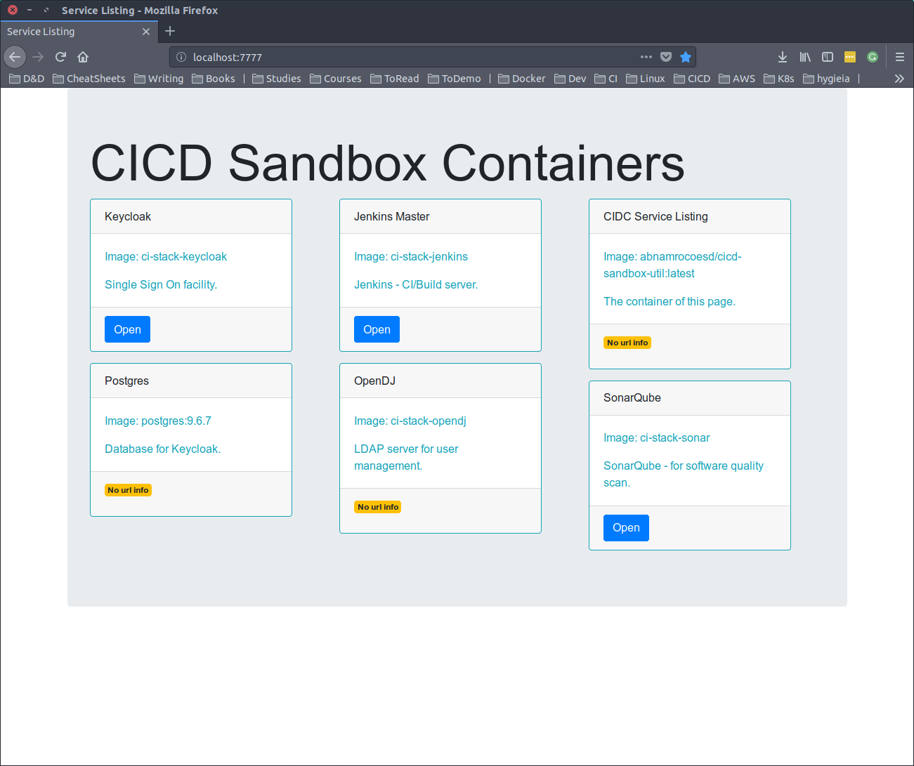

# Service Listing

The service listing is there to help you visualize the running containers of your CICD sandbox.

It can do this in two ways, print the listing or host the listing as a html page.

## Print Listing

```bash
docker run --rm --name util-temp \
   -v /var/run/docker.sock:/var/run/docker.sock \
   abnamrocoesd/cicd-sandbox-util \
   cicd-util --action list-docker --namespace cidc\
   --labelPrefix com.github.joostvdg.
```

This will result in the following response:

```bash
== EXTERNAL_HOSTNAME=
== Hostname to use: 4189e58394ca
== Action to perform: list-docker
 > Probing Host: unix:///var/run/docker.sock
 > We found these containers: 
   > [Name=Keycloak, Description=Single Sign On facility, WebPath=/, WebPort=8280]
   > [Name=Postgres, Description=Database for Keycloak, WebPath=, WebPort=]
   > [Name=Jenkins Master, Description=Jenkins - CI/Build server, WebPath=/jenkins, WebPort=8282]
   > [Name=OpenDJ, Description=LDAP server for user management, WebPath=, WebPort=]
   > [Name=CIDC Service Listing, Description=The container of this page, WebPath=, WebPort=]
   > [Name=SonarQube, Description=SonarQube - for software quality scan, WebPath=/sonar, WebPort=8289]
-----------------
```

## Host Listing

```bash
docker run --rm --name util-temp abnamrocoesd/cicd-sandbox-util\
    cicd-util -action serve \
    -labelPrefix "my.labe.prefix." -namespace "myNamespace"
```
This will result in something like this:



## How to use

The util application has several actions you can choose from.

Two of those actions are related to the service listing: ```list-docker``` and ```serve```.

There are two parameters you will need to supply for both of these actions: ```-labelPrefix``` and ```-namespace```.

* **labelPrefix**: the prefix you use for the docker labels in the docker configuration
* **namespace**: the namespace to filter on, this allows you to have separate sets of containers using the same label prefix but different namespace. Be sure to end in a ```.```!

There are several optional parameters as well:

* **name**: the name of the service
* **description**: a short description of the service
* **webPath**: the **path** to the application in the container that is useful to the user, leave blank if there's no such thing
* **webPort**: the **port** for the ***webPath***, leave blank if there's no such thing

### Docker configuration

As briefly mentioned, you need to use labels within your docker configuration.

As the service listing is itself also a web application, you can also use it to list itself!

```yaml
  service-listing: 
    image: abnamrocoesd/cicd-sandbox-util:latest
    labels:
      - my.label.prefix.namespace=wisent
      - my.label.prefix.name="CIDC Service Listing"
      - my.label.prefix.description="The container of this page"
      - my.label.prefix.webPath=/
      - my.label.prefix.webPort=7777
    command: cicd-util -action serve -labelPrefix "my.label.prefix." -namespace "myNamespace"
    restart: always
    volumes: ["/var/run/docker.sock:/var/run/docker.sock"]
    ports:
      - 7777:7777
```

